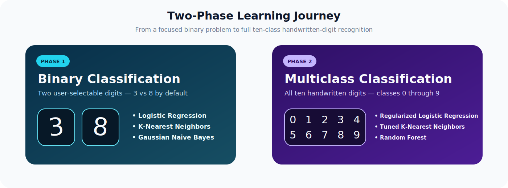
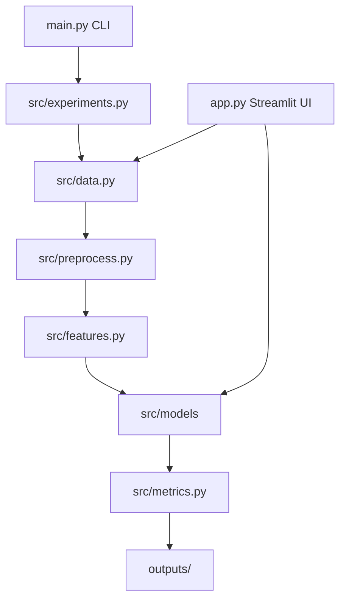

<div align="center">


<br>


### Classical machine-learning algorithms implemented from scratch for binary and multiclass handwritten-digit recognition

[Overview](#project-overview) •
[Two Phases](#the-two-project-phases) •
[Algorithms](#algorithms-implemented-from-scratch) •
[Demo](#interactive-streamlit-demo) •
[Installation](#installation-and-setup) •
[Configuration](#configuration-reference)

</div>

---

## Project Overview

**Binary-Multiclassification-of-MNIST** is an end-to-end classical machine-learning project built to explain what happens beneath high-level ML libraries. Instead of calling ready-made classifiers, the project implements the learning algorithms, feature transformations, metrics, validation logic, and experiment orchestration manually with NumPy and standard Python.

The project begins with a focused binary classification problem—distinguishing handwritten digits **3 and 8** by default—and then expands into full multiclass recognition across all MNIST digits from **0 through 9**. This progression makes the repository both a practical classifier and a structured study of how classical machine learning scales from a simple decision boundary to a significantly more complex ten-class task.

The repository goes beyond model fitting. It includes reusable data utilities, manual feature extraction, stratified splitting, configurable experiments, hyperparameter exploration, detailed evaluation, output generation, performance optimizations, and a Streamlit interface for interactive predictions.

> [!IMPORTANT]
> The focus of this project is educational transparency. Core models and transformations are implemented manually rather than delegated to prebuilt scikit-learn estimators.

## Why This Project Matters

MNIST is often introduced through a short neural-network example, but it is also an excellent environment for understanding the foundations of machine learning. Its 28×28 grayscale images create a realistic high-dimensional problem while remaining small enough for experimentation and visualization.

This project explores several important questions:

- How does binary classification differ from multiclass classification?
- How do raw pixels compare with PCA and HOG representations?
- Why does normalization and standardization matter?
- How do logistic regression, KNN, Naive Bayes, decision trees, and random forests behave on image data?
- How can vectorization substantially improve manual algorithms?
- How should multiclass performance be measured beyond overall accuracy?
- How can a training pipeline be exposed through an interactive application?

## Project Highlights

- Two progressive learning phases: binary and multiclass classification.
- Manual implementations of classical machine-learning algorithms.
- Three supported feature representations: Flatten, PCA, and HOG.
- Configurable experiments through JSON files and command-line arguments.
- Stratified training, validation, and testing splits.
- Optional stratified subsampling for fast experiments.
- Per-class and aggregate evaluation metrics.
- Vectorized Logistic Regression and KNN computations.
- PCA optimized with the dual covariance approach.
- Streamlit demo for held-out and user-uploaded digit images.
- Probability display for models that expose `predict_proba`.
- Reproducible runs through configurable random seeds.

## The Two Project Phases

<p align="center">
  
</p>

### Phase 1 — Binary Classification

Phase 1 establishes the complete pipeline using two handwritten digits. The default task distinguishes digit **3** from digit **8**, although the command-line workflow and demo allow the selected pair to be changed.

This phase is intentionally focused: it makes model behavior easier to inspect, reduces training time, and provides a controlled environment for comparing feature representations and classical algorithms.

#### Phase 1 capabilities

- User-selectable binary digit pair.
- Default classification task: 3 versus 8.
- Binary label remapping for model training.
- Flattened pixels, manual PCA, or manual HOG features.
- Logistic Regression, KNN, and Gaussian Naive Bayes in the default configuration.
- Configurable PCA components and HOG parameters.
- Accuracy, precision, recall, F1 score, and confusion-matrix analysis.
- Fast configuration using equal samples per class.

#### Default Phase 1 experiment matrix

| Feature representation | Logistic Regression | KNN | Gaussian Naive Bayes |
|---|:---:|:---:|:---:|
| Flattened pixels | ✓ | ✓ | ✓ |
| PCA | ✓ | ✓ | ✓ |
| HOG | ✓ | ✓ | ✓ |

With three feature representations and three default models, Phase 1 supports a clear nine-experiment comparison before additional tuning.

### Phase 2 — Multiclass Classification

Phase 2 expands the task to all ten MNIST classes. This changes the problem substantially: the classifier must now learn several decision boundaries, evaluation must consider every digit, and computational efficiency becomes far more important.

The improved workflow introduces regularization, tuning, optimized numerical operations, and a reduced search space that keeps experiments practical while preserving the from-scratch learning objective.

#### Phase 2 capabilities

- Full classification across digits 0–9.
- Regularized multiclass Logistic Regression.
- Tuned K-Nearest Neighbors.
- Manual Random Forest classification.
- PCA-focused improved configuration.
- Manual hyperparameter exploration.
- Cross-validation-based comparison.
- Per-class precision, recall, and F1 scores.
- Macro and weighted aggregate metrics.
- Configurable sample count per class for runtime control.

## Dataset

The project uses the **MNIST handwritten-digit dataset**, a standard benchmark containing grayscale images of handwritten digits.

| Property | Value |
|---|---|
| Image size | 28 × 28 pixels |
| Channels | 1 grayscale channel |
| Input dimensionality | 784 raw pixel features |
| Classes | Digits 0–9 |
| Standard training set | 60,000 images |
| Standard test set | 10,000 images |
| Pixel range after normalization | 0.0–1.0 |

The loader supports TensorFlow/Keras as the primary MNIST source, while the experiment configuration also provides an IDX-loading option for locally stored MNIST files.

### Data pipeline


### Splitting strategy

The dataset is split using class-aware stratification so that each subset maintains an appropriate representation of every selected digit. The default proportions are:

| Subset | Proportion | Purpose |
|---|---:|---|
| Training | 70% | Fit model parameters |
| Validation | 10% | Compare settings and monitor generalization |
| Testing | 20% | Final evaluation on unseen samples |

## Feature Engineering

Image classification performance depends heavily on how the image is represented. This project supports three different feature pipelines, allowing direct comparison between raw intensity values, compressed representations, and shape-oriented descriptors.

### 1. Flattened Pixel Features

Each 28×28 image is reshaped into a 784-dimensional vector. The features preserve all original pixel intensities and are standardized before training.

**Advantages**

- Preserves the complete input image.
- Simple and transparent representation.
- Useful as a baseline for all models.

**Trade-offs**

- High dimensionality.
- Sensitive to small shifts in handwriting position.
- Can make distance-based algorithms slower.

### 2. Principal Component Analysis

PCA reduces the 784 raw features into a smaller set of orthogonal components that preserve as much variance as possible. The implementation is manual and uses the **dual covariance trick** when appropriate, making it more efficient when the number of samples is smaller than the feature dimension.

**Advantages**

- Reduces memory and computation.
- Removes redundant pixel relationships.
- Can improve KNN and Logistic Regression runtime.
- Provides a configurable number of components.

**Trade-offs**

- Components are less visually interpretable than original pixels.
- Aggressive reduction can discard useful digit information.

### 3. Histogram of Oriented Gradients

HOG represents local edge direction and intensity rather than raw pixel brightness. The extractor divides the image into cells, builds orientation histograms, and normalizes neighboring blocks.

The following parameters are configurable:

- Cell size
- Block size
- Number of orientation bins

HOG is particularly relevant to handwritten digits because digit identity is strongly connected to stroke direction and overall shape.

## Algorithms Implemented From Scratch

### Logistic Regression

The Logistic Regression implementation supports binary and multiclass learning with mini-batch gradient descent. The improved version relies on vectorized NumPy operations, avoiding slow feature-by-feature Python loops.

Key implementation details include:

- Configurable learning rate and epoch count.
- Mini-batch updates.
- Cross-entropy-based optimization.
- Binary and multiclass output handling.
- Optional L2 regularization.
- Configurable regularization strength.
- Reproducible parameter initialization.

### K-Nearest Neighbors

KNN predicts a label by measuring the distance between an input sample and stored training samples. The implementation manually computes Euclidean distances and selects the closest neighbors.

The optimized version vectorizes the distance calculation, avoiding a Python loop over every feature and substantially reducing prediction time.

Key parameters include:

- Number of neighbors, `k`.
- Distance function.
- Feature representation.

### Gaussian Naive Bayes

Gaussian Naive Bayes models each feature using a class-specific Gaussian distribution. It estimates the mean and variance of every feature for every class, combines those likelihoods with class priors, and selects the most probable label.

Its strong assumptions make it a useful fast baseline and provide an interesting contrast with more flexible models.

### Decision Tree

The project model library includes a recursive Decision Tree implementation based on impurity reduction. Candidate splits are evaluated using Gini impurity and information gain, producing an interpretable hierarchy of feature decisions.

### Random Forest

The Random Forest implementation combines multiple manually constructed decision trees through bootstrap aggregation and random feature selection.

Important controls include:

- Number of estimators.
- Maximum tree depth.
- Minimum samples required to split.
- Minimum samples per leaf.
- Number of candidate thresholds.
- Random feature selection.
- Bootstrap sampling.
- Reproducible random state.

The final prediction is produced through majority voting across the forest.

## Performance Optimizations

Implementing algorithms manually makes computational bottlenecks easy to observe. The improved pipeline focuses on reducing unnecessary Python-level work while keeping the underlying algorithms transparent.

### Vectorized Logistic Regression

Gradient and probability calculations are performed using matrix operations. This allows NumPy's optimized numerical backend to replace repeated scalar operations.

### Vectorized KNN Distances

Distance calculations are expressed as array operations rather than nested loops. This is especially important because KNN performs most of its work during prediction.

### Dual Covariance PCA

For data with fewer samples than features, decomposing the sample-space matrix can be significantly cheaper than directly decomposing the full feature covariance matrix. This optimization produces the largest runtime improvement in the high-dimensional MNIST pipeline.

### Practical Search Spaces

The improved Phase 2 configuration intentionally limits the search space. This makes experimentation feasible on an ordinary laptop while still demonstrating manual model selection and hyperparameter comparison.

## Evaluation Framework

The project evaluates models using both aggregate and per-class metrics.

| Metric | What it measures |
|---|---|
| Accuracy | Overall proportion of correct predictions |
| Precision | Reliability of positive predictions for each class |
| Recall | Proportion of each class successfully detected |
| F1 score | Harmonic balance between precision and recall |
| Macro F1 | Equal-weight average across all classes |
| Weighted F1 | Class-frequency-weighted average |
| Confusion matrix | Exact pattern of correct and incorrect classifications |
| Cross-validation score | Stability across multiple data partitions |

Macro F1 is especially useful in multiclass evaluation because it gives each digit equal importance, while weighted F1 reflects the class distribution in the evaluated set.

## Interactive Streamlit Demo

The repository includes a lightweight local website that exposes the manual pipeline through an interactive interface.

### Demo controls

- Select Phase 1 or Phase 2.
- Choose Flatten, PCA, or HOG feature extraction.
- Select a compatible model for the chosen phase.
- Choose the two binary digits in Phase 1.
- Adjust samples per class.
- Adjust PCA component count.
- Configure HOG cell size, block size, and orientation bins.
- Select a reproducible random seed.
- Train or load the selected model.

### Demo outputs

- Validation accuracy.
- Test accuracy.
- Macro F1.
- Weighted F1.
- Training, validation, and testing set sizes.
- True and predicted labels for held-out MNIST examples.
- Class probabilities when supported by the selected model.

### Custom image prediction

Users can upload a PNG or JPEG containing a handwritten digit. The application:

1. Converts the image to grayscale.
2. Resizes it while preserving its aspect ratio.
3. Centers it on a 28×28 canvas.
4. Optionally inverts its colors.
5. Normalizes its pixels.
6. Applies the selected feature pipeline.
7. Predicts the digit using the trained manual classifier.

<!--
Add a Streamlit screenshot to assets/streamlit_demo.png, then remove these comment markers.

<p align="center">
  
</p>
-->

## Project Architecture



### Design principles

- **Separation of concerns:** loading, preprocessing, features, models, metrics, and orchestration are separated into modules.
- **Reusable interfaces:** models expose familiar `fit`, `predict`, and optional `predict_proba` behavior.
- **Configuration-driven experiments:** dataset size, feature representation, model choice, and algorithm settings can be changed without rewriting the pipeline.
- **Reproducibility:** random seeds are passed through data sampling and model training.
- **Demo efficiency:** Streamlit caches both loaded data and trained model bundles.

## Repository Structure

```text
Binary-Multiclassification-of-MNIST/
├── assets/
│   ├── mnist_project_banner.svg
│   └── phase_overview.svg
├── src/
│   ├── models/
│   │   ├── logistic_regression.py
│   │   ├── knn.py
│   │   ├── gaussian_nb.py
│   │   ├── decision_tree.py
│   │   └── random_forest.py
│   ├── data.py
│   ├── experiments.py
│   ├── features.py
│   ├── metrics.py
│   ├── preprocess.py
│   ├── utils.py
│   ├── validation.py
│   └── visualization.py
├── outputs/
├── app.py
├── main.py
├── phase1_config.json
├── phase1_fast_config.json
├── phase2_fast_config.json
├── phase2_improved_config.json
├── requirements_demo.txt
└── README.md
```

> [!NOTE]
> Generated `__pycache__` directories and `.pyc` files should not be committed. Add them to `.gitignore` because they are machine-generated Python bytecode.

## Installation and Setup

### 1. Clone the repository

```bash
git clone https://github.com/Marwanwagih/Binary-Multiclassification-of-MNIST.git
cd Binary-Multiclassification-of-MNIST
```

### 2. Create a virtual environment

#### Windows PowerShell

```powershell
python -m venv .venv
.venv\Scripts\Activate.ps1
```

#### Windows Command Prompt

```bat
python -m venv .venv
.venv\Scripts\activate.bat
```

#### macOS or Linux

```bash
python3 -m venv .venv
source .venv/bin/activate
```

### 3. Install the dependencies

```bash
pip install -r requirements_demo.txt
```

The demo depends on:

- NumPy
- Matplotlib
- TensorFlow
- Pillow
- Streamlit

## Running the Experiments

### Phase 1: full binary experiment

```bash
python main.py --phase 1 --config phase1_config.json
```

### Phase 1: faster binary experiment

```bash
python main.py --phase 1 --config phase1_fast_config.json
```

### Phase 1: choose another digit pair

```bash
python main.py --phase 1 --class-a 4 --class-b 9 --subsample-per-class 1000
```

### Phase 2: fast multiclass experiment

```bash
python main.py --phase 2 --config phase2_fast_config.json
```

### Phase 2: improved pipeline

```bash
python main.py --phase 2 --improved --config phase2_improved_config.json
```

### Select an output directory

```bash
python main.py --phase 2 --improved --output-dir outputs/phase2_run
```

## Running the Streamlit Demo

```bash
streamlit run app.py
```

Streamlit will print a local address, normally:

```text
http://localhost:8501
```

Open that address in a browser, choose a phase, feature representation, and model, then click **Train / Load model**.

> [!TIP]
> The demo intentionally uses smaller per-class subsets so a manual model can train interactively on a normal laptop.

## Configuration Reference

Experiment behavior is controlled through JSON configuration files and optional command-line overrides.

| Configuration key | Purpose | Example |
|---|---|---|
| `phase` | Select binary or multiclass workflow | `1` or `2` |
| `class_a` | First binary digit | `3` |
| `class_b` | Second binary digit | `8` |
| `features` | Feature pipelines to compare | `flatten`, `pca`, `hog` |
| `models` | Models to evaluate | `logreg`, `knn`, `gnb` |
| `pca_components` | Retained PCA dimensions | `50` |
| `hog_cell_size` | HOG pixels per cell | `4` |
| `hog_block_size` | HOG cells per block | `2` |
| `hog_bins` | Orientation histogram bins | `9` |
| `val_ratio` | Validation fraction | `0.10` |
| `test_ratio` | Test fraction | `0.20` |
| `subsample_per_class` | Maximum samples for each class | `1000` |
| `balance_train` | Enable training-set balancing | `false` |
| `random_state` | Reproducible random seed | `42` |
| `rf_n_estimators` | Random Forest tree count | `15` |
| `rf_max_depth` | Maximum tree depth | `12` |
| `mnist_loader` | Dataset source | `tensorflow` or `idx` |
| `data_dir` | Local dataset directory | `data` |
| `output_dir` | Generated-result directory | `outputs` |

Command-line arguments override matching values from the selected configuration file.

## Recommended Experiment Order

If you are exploring the project for the first time, use this sequence:

1. Run the fast Phase 1 configuration.
2. Compare Flatten, PCA, and HOG results.
3. Change the binary digit pair and observe which combinations are harder.
4. Run the Phase 2 fast configuration.
5. Run the improved Phase 2 PCA pipeline.
6. Launch Streamlit and test held-out samples.
7. Upload your own handwritten digit and inspect its probabilities.

## Adding Result Images

For the strongest GitHub presentation, add generated figures or screenshots to `assets/` using names such as:

```text
assets/
├── streamlit_demo.png
├── binary_confusion_matrix.png
├── multiclass_confusion_matrix.png
├── feature_comparison.png
└── sample_predictions.png
```

Then display them with standard Markdown:

```markdown

```

Or use centered HTML with a controlled width:

```html
<p align="center">
  
</p>
```

## Limitations

- Manual algorithms are slower than highly optimized production libraries.
- Large KNN experiments can be expensive because prediction compares samples with the stored training set.
- MNIST images are centered and standardized; real-world handwritten images may require stronger preprocessing.
- A small Streamlit subset is appropriate for demonstration but does not represent full-dataset training.
- Reduced search spaces prioritize practical runtime over exhaustive hyperparameter optimization.
- Classical models may not match modern convolutional neural networks on full MNIST accuracy.
- Results on MNIST should not be assumed to transfer directly to unrelated image-classification tasks.

## Future Improvements

- Add probability calibration and confidence analysis.
- Add learning curves and runtime benchmarks.
- Add automated unit tests for every model and transformation.
- Save and reload fitted manual models.
- Add drag-and-draw digit input using an HTML canvas.
- Add model explanations and nearest-neighbor visualization.
- Compare manual implementations with equivalent scikit-learn baselines.
- Add convolutional neural-network results as a modern benchmark.
- Add experiment tracking and reproducible result summaries.
- Containerize the Streamlit demo with Docker.
- Deploy the interface to a public cloud platform.

## Educational Takeaways

Completing this project demonstrates practical understanding of:

- Binary and multiclass classification.
- Gradient-based optimization.
- Distance-based learning.
- Probabilistic classification.
- Tree-based learning and bagging.
- Feature scaling and data preprocessing.
- Dimensionality reduction.
- Gradient-based image descriptors.
- Hyperparameter selection.
- Cross-validation and test-set evaluation.
- Vectorization and runtime optimization.
- Modular ML software design.
- Interactive model deployment.

## Disclaimer

This repository is an educational machine-learning implementation. It is not intended as a production optical-character-recognition system, and reported performance should always be interpreted alongside the selected dataset size, feature representation, configuration, and random seed.

---

<div align="center">

### Built to understand machine learning—not only to call it.

If this repository helped you learn, consider giving it a ⭐

</div>
